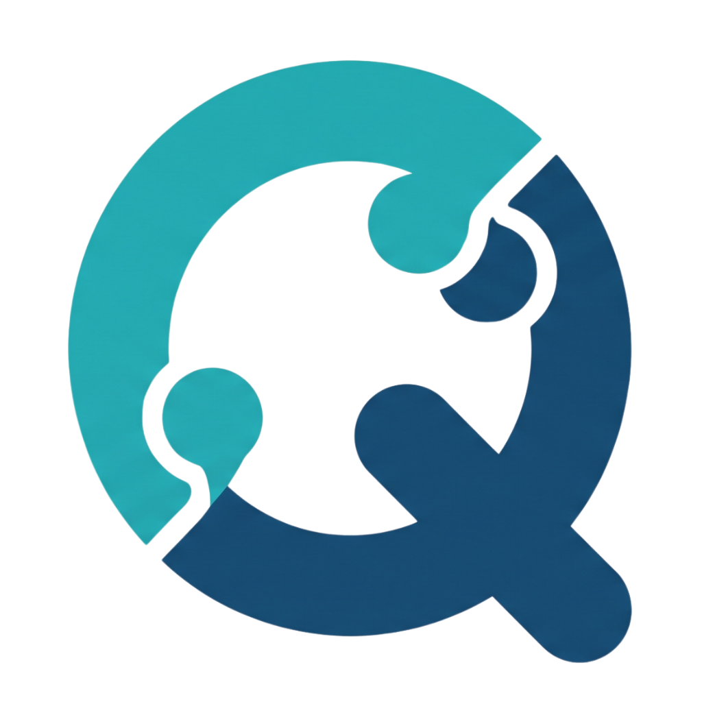

<div align="center">
  
  <h1>QLOP</h1>
  <p><strong>AI-Driven Skill Gap Analysis & Career Navigation Platform</strong></p>
  <p>Bridge the gap between talent and opportunity — powered by NLP, ML, and Generative AI.</p>
</div>

---

<div align="center">

### Frontend


### Backend


### AI Engine


### Data Science


### Infrastructure


</div>

---

## Project Description

QLOP is a web-based application designed to bridge the skill gap between new graduates and digital industry requirements. By leveraging Natural Language Processing (NLP) technology, the system automatically extracts skill entities from user Curriculum Vitae (CV) documents, compares them with actual job market trends obtained through web scraping, and provides personalized, objective learning recommendations.

The AI pipeline runs in **three phases**:
1. **Extract** — DeBERTa-v3 NER model parses a CV PDF into a structured profile
2. **Analyze** — TensorFlow models compute skill gap, course recommendations, and SBERT readiness score in parallel
3. **Career Pivot Radar** — SBERT RAG + Groq Llama 3.3 70B (3-turn chain-of-thought) suggests personalized career paths

## Repository Structure (Monorepo)

```text
qlop/
├── frontend/             # User Interface (React + Vite + Tailwind)
├── backend/              # Main API Server & Business Logic (Express.js)
├── ai_engine/            # NLP Model Service & AI API (FastAPI)
├── data_science/         # Scraping Scripts & Analytical Dashboard (Streamlit)
└── docs/                 # Project Documentation & Final Deliverables
```

## Environment Setup Instructions

### Prerequisites

- Node.js (Version 18+)
- Python (Version 3.10 or 3.11)
- PostgreSQL

### Installation Steps

#### 1. Clone the Repository

```bash
git clone https://github.com/QLOP-CC26/qlop.git
cd qlop
```

#### 2. Backend & Frontend Configuration

Navigate to the respective folders (`backend/` and `frontend/`), copy `.env.example` to `.env`, and install dependencies:

```bash
npm install
```

#### 3. AI Engine & Data Science Configuration

Navigate to the respective folders (`ai_engine/` and `data_science/`), copy `.env.example` to `.env`, create a virtual environment, and install dependencies:

```bash
python -m venv .venv
# Windows
.\.venv\Scripts\Activate.ps1
# Linux/macOS
source .venv/bin/activate

pip install -r requirements.txt
```

## How to Run the Application

| Service | Directory | Command |
|---------|-----------|---------|
| AI Engine | `ai_engine/` | `uvicorn app:app --reload` |
| Backend | `backend/` | `npm run dev` |
| Frontend | `frontend/` | `npm run dev` |
| DS Dashboard | `data_science/` | `streamlit run app.py` |

> **Start order:** AI Engine → Backend → Frontend

## Production Deployment

Recommended split for production:

| Service | Recommended host | Notes |
|---------|------------------|-------|
| AI Engine | Railway Docker service | Best for TensorFlow + Hugging Face model loading |
| Backend | Railway or VPS | Must point `AI_API_URL` to the AI Engine public URL |
| Frontend | Netlify / Vercel / static hosting | Set `VITE_API_URL` to the backend public URL |
| Database | Managed PostgreSQL | Use a hosted Postgres for reliability |

If you deploy AI Engine separately, the backend does not need private network access. It only needs the public `AI_API_URL` value. For a low-RAM VPS, do not host the AI Engine there unless you are willing to accept slow startup and possible memory pressure.

## Team Members (CC26-PSU101)

| Name | Role |
|------|------|
| Fauzan Arif Tricahya | Full-Stack Web Developer |
| Wandy Chandra Wijaya | Full-Stack Web Developer |
| Diko Duwi Saputra | Data Scientist |
| Dinaranaya Putri Hutauruk | Data Scientist |
| Husni Abdillah | AI Engineer |
| Gilang Agung Prakoso | AI Engineer |

---

<div align="center">
  © 2026 QLOP Team · MIT License · DBS Foundation Coding Camp CC26-PSU101
</div>
